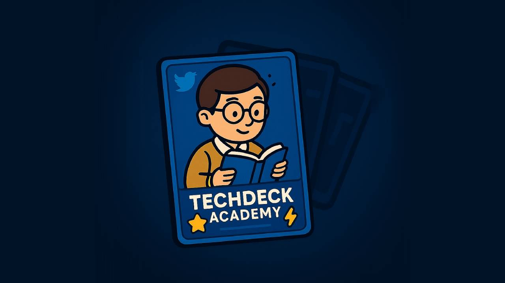

# TechDeck Academy



Welcome to the open-source version of **TechDeck Academy**! This project provides a framework for an AI-powered, personalized learning experience driven by GitHub Actions and powered by Google Gemini. It's designed to help users learn technical subjects through AI-generated challenges, feedback, Q&A, and progress tracking.

## ✨ Key Features

*   **AI-Generated Challenges:** Automatically creates coding or technical challenges based on user configuration (`config.ts`) and AI context (`ai-memory.md`). Ensures challenges are relevant and avoid immediate repetition.
*   **Personalized Feedback:** AI analyzes submissions, providing qualitative feedback (strengths, weaknesses, suggestions) in Markdown format, guided by a chosen mentor persona and user history. AI is prompted to include a score justification within the text, but this score is not stored or processed by the application.
*   **AI Mentor Q&A:** Users ask questions via markdown files (`letters/to-mentor/`); AI responds based on persona and context, logging insights to `ai-memory.md`. AI is prompted to suggest config changes if appropriate.
*   **Automated Progress Tracking:** Generates narrative progress summaries (digests) based on `ai-memory.md`.
*   **User-Controlled Configuration:** `config.ts` is the single source of truth for user settings (topics, difficulty, schedule, mentor). The application syncs the profile to this config but does not automatically change difficulty/topic levels based on performance.
*   **GitHub-Based Workflow:** Leverages GitHub Actions for automation; Git stores state (profile, memory, challenges, etc.).
*   **State Management:** Uses `student-profile.json` for minimal essential state (status, completion count, last updated) and `ai-memory.md` for rich, dynamic AI context.
*   **Data Management:** Archives old interaction files.

## ⚙️ How It Works

TechDeck Academy operates primarily through a set of GitHub Actions:

1.  **Configuration (`config.ts`):** User defines preferences (topics, levels, difficulty, types), schedule, mentor. **This file is the source of truth for these settings.**
2.  **Profile Initialization/Sync (`loadOrCreateAndSyncProfile` in `profile-manager.ts`, called by workflows):** Reads `student-profile.json`. If non-existent, creates it using `config.ts` values (userId, name, difficulty -> currentSkillLevel, topics -> topicLevels, initial status based on `introductionSubmitted`). If exists, syncs `userId`, `name`, `topicLevels` from `config.ts`. **Does NOT auto-update `status` or `currentSkillLevel` from config after creation.**
3.  **Challenge Generation (`send-challenge.yml`):** Runs on schedule/manually. Checks if challenges exist (skips if yes). If user profile `status` is `'active'` (or `introductionSubmitted` is true), calls `ai.generateChallenge`. This function:
    *   Prompts AI for **Markdown** challenge content (Title, Description, Topics, Requirements, Examples, Hints) based on config and AI memory.
    *   Parses the AI's Markdown response locally.
    *   Adds locally generated `id`, `createdAt`, and locally determined `type` and `difficulty` (from config).
    *   Validates and saves the complete challenge object as a `.json` file in `challenges/`.
    *   Sends email notification.
4.  **Submission Processing (`process-submissions.yml`):** Triggered by push to `submissions/`. Calls `ai.generateFeedback`. This function:
    *   Prompts AI for **Markdown** feedback (Strengths, Weaknesses, Suggestions, Improvement Path), asking it to include score/justification *in the text* and suggest config review if needed.
    *   Parses the AI's Markdown response locally, **ignoring any score text.**
    *   Creates a `Feedback` object (no `score` field) with local `submissionId`, `createdAt` and parsed qualitative fields.
    *   Saves feedback as `.json` in `feedback/`.
    *   Updates `student-profile.json` (increments `completedChallenges`, updates `lastUpdated`, **no score processing**).
    *   Updates `ai-memory.md` with a qualitative summary.
    *   Sends feedback email.
5.  **Letter Processing (`respond-to-letters.yml`):** Triggered by push to `letters/to-mentor/`. Uses AI to generate response (JSON format for `LetterResponse` including `content` and `insights`), logs insights to `ai-memory.md`, emails `content`, archives letter. **If first letter & `introductionSubmitted` is false, updates profile `status` to `'active'`, enabling challenges.** Also prompts AI to suggest config review if appropriate.
6.  **Digest Generation (`generate-digests.yml`):** Runs on schedule. Uses AI to generate a *narrative summary* of the entire `ai-memory.md` for the period (weekly/monthly/quarterly). Saves to `progress/`.
7.  **File Rotation (`rotate-files.yml`):** Periodically archives old challenges, submissions, feedback based on `config.ts`.

## 📂 Project Structure

The project is organized as follows:

```
techdeck-academy/
├── .github/workflows/     # GitHub Actions for automation
│   ├── send-challenge.yml
│   ├── process-submissions.yml
│   ├── respond-to-letters.yml # Handles Q&A, profile updates, status change
│   ├── generate-digests.yml
│   └── rotate-files.yml
├── config.ts              # User configuration (topics, levels, difficulty, schedule)
├── ai-memory.md           # AI's persistent narrative context (updated automatically)
├── student-profile.json   # Minimal student profile state (status, counters, timestamp)
├── src/                   # Source code (TypeScript)
│   ├── types.ts           # Core type definitions
│   ├── schemas.ts         # Zod validation schemas
│   ├── profiles/          # AI mentor personality definitions (e.g., linus.ts)
│   ├── utils/             # Helper functions (AI, email, files, managers)
│   │   ├── ai.ts          # Gemini interactions & prompt generation
│   │   ├── ai-memory-manager.ts # Manages ai-memory.md
│   │   ├── profile-manager.ts # Manages student-profile.json & profile logic
│   │   └── ...
│   └── scripts/           # Scripts executed by workflows
├── challenges/            # Stores generated challenges (structured JSON)
├── submissions/           # User pushes solutions here
├── feedback/              # Stores AI-generated feedback (structured JSON, no score)
├── letters/               # Stores user questions and mentor responses
│   ├── to-mentor/         # User pushes questions here (.md)
│   └── from-mentor/       # AI saves responses here (JSON: content + insights)
├── archive/               # Stores old data after rotation
│   ├── challenges/
│   ├── submissions/
│   ├── feedback/
│   └── letters/
├── progress/              # Stores progress digests and stats
│   ├── stats.json         # Raw statistics (optional/TBD)
│   ├── roadmap.md         # User-managed learning roadmap
│   └── ... (digest files: weekly/, monthly/, etc.)
├── README.md              # This file
└── LICENSE                # Project License
```

## 🚀 Getting Started

1.  **Fork & Clone:** Fork to your GitHub, then clone your fork.
2.  **Install:** `npm install`
3.  **API Keys:** Create `.env` with `GEMINI_API_KEY` and `RESEND_API_KEY`. **Crucially, also add these as GitHub Secrets in your repo settings.**
4.  **Customize `config.ts`:** Set `userEmail`, `githubUsername`, `topics` & `currentLevel`, `difficulty`, `mentorProfile`, etc. Decide on `introductionSubmitted` (default `false` recommended).
5.  **First Letter (if `introductionSubmitted: false`):** Create `.md` file in `letters/to-mentor/` with intro/goals. Commit & push.
6.  **Commit & Push Config:** Commit `config.ts` (and `.gitignore` if `.env` added). Push.
7.  **Enable & Understand Actions:** Check Actions tab. `send-challenge.yml` needs `status: 'active'` (set after first letter OR via `introductionSubmitted: true`). Use `workflow_dispatch` for manual runs if needed.

## 🔄 Resetting Your Progress

To reset (delete state files), use:

```bash
npm run reset
```
**Then commit and push the deletions.** This clears `student-profile.json`, `ai-memory.md`, `challenges/`, `submissions/`, `feedback/`, `letters/`, `progress/`, `archive/`. You'll need to restart the introduction flow (submit first letter or set config flag) to get challenges again.

## 🤝 Contributing

Contributions welcome! Please open issues or PRs.

## 📄 License

MIT License - see [LICENSE](LICENSE) file.